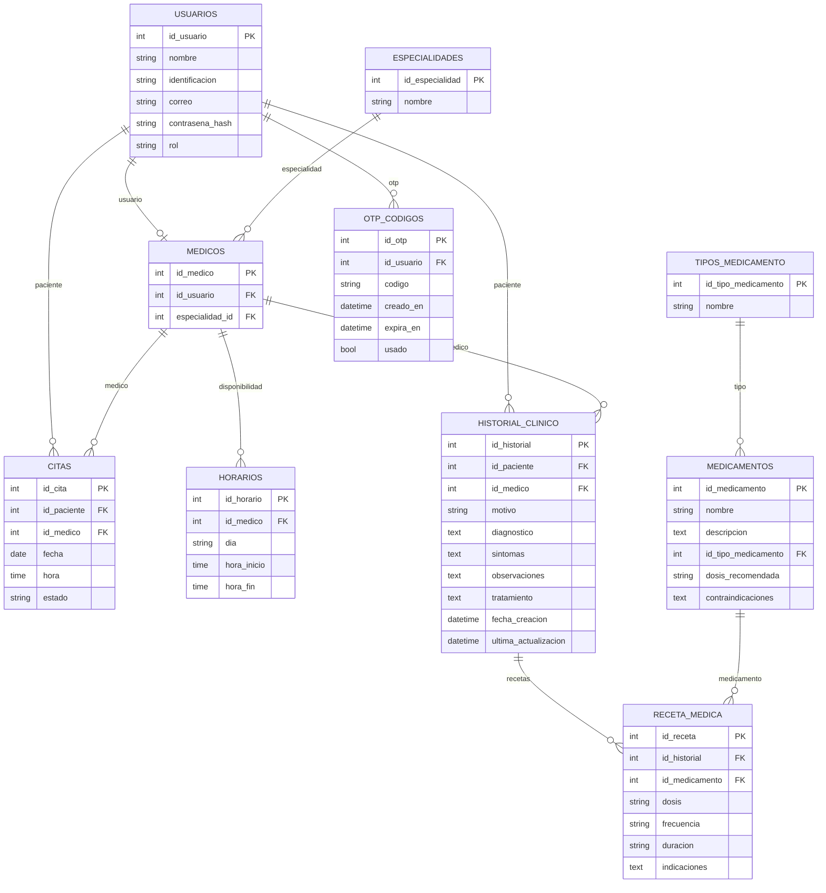

# Modelo relacional

Diagrama ER basado en los modelos SQLAlchemy.

## Tablas y campos

### usuarios
| columna | tipo | PK | FK | notas |
| --- | --- | --- | --- | --- |
| id_usuario | int | si |  |  |
| nombre | string(120) |  |  | not null |
| identificacion | string(20) |  |  | unique, not null |
| correo | string(255) |  |  | unique, not null |
| contrasena_hash | string(255) |  |  | nullable |
| rol | enum |  |  | valores: paciente, medico, admin |

### medicos
| columna | tipo | PK | FK | notas |
| --- | --- | --- | --- | --- |
| id_medico | int | si |  |  |
| id_usuario | int |  | usuarios.id_usuario | unique, not null |
| especialidad_id | int |  | especialidades.id_especialidad | not null |

### especialidades
| columna | tipo | PK | FK | notas |
| --- | --- | --- | --- | --- |
| id_especialidad | int | si |  |  |
| nombre | string(120) |  |  | unique, not null |

### citas
| columna | tipo | PK | FK | notas |
| --- | --- | --- | --- | --- |
| id_cita | int | si |  |  |
| id_paciente | int |  | usuarios.id_usuario | not null |
| id_medico | int |  | medicos.id_medico | not null |
| fecha | date |  |  | not null |
| hora | time |  |  | not null |
| estado | enum |  |  | valores: pendiente, confirmada, cancelada, rechazada |

### horarios
| columna | tipo | PK | FK | notas |
| --- | --- | --- | --- | --- |
| id_horario | int | si |  |  |
| id_medico | int |  | medicos.id_medico | not null |
| dia | enum |  |  | valores: lunes, martes, miercoles, jueves, viernes, sabado, domingo |
| hora_inicio | time |  |  | not null |
| hora_fin | time |  |  | not null |

### historial_clinico
| columna | tipo | PK | FK | notas |
| --- | --- | --- | --- | --- |
| id_historial | int | si |  |  |
| id_paciente | int |  | usuarios.id_usuario | not null |
| id_medico | int |  | medicos.id_medico | not null |
| motivo | string(50) |  |  | not null |
| diagnostico | text |  |  | not null |
| sintomas | text |  |  | not null |
| observaciones | text |  |  | not null |
| tratamiento | text |  |  | not null |
| fecha_creacion | datetime |  |  | default now |
| ultima_actualizacion | datetime |  |  | default now, on update now |

### receta_medica
| columna | tipo | PK | FK | notas |
| --- | --- | --- | --- | --- |
| id_receta | int | si |  |  |
| id_historial | int |  | historial_clinico.id_historial | not null |
| id_medicamento | int |  | medicamentos.id_medicamento | not null |
| dosis | string(120) |  |  | not null |
| frecuencia | string(120) |  |  | not null |
| duracion | string(120) |  |  | not null |
| indicaciones | text |  |  | not null |

### medicamentos
| columna | tipo | PK | FK | notas |
| --- | --- | --- | --- | --- |
| id_medicamento | int | si |  |  |
| nombre | string(120) |  |  | unique, not null |
| descripcion | text |  |  | not null |
| id_tipo_medicamento | int |  | tipos_medicamento.id_tipo_medicamento | not null |
| dosis_recomendada | string(120) |  |  | not null |
| contraindicaciones | text |  |  | not null |

### tipos_medicamento
| columna | tipo | PK | FK | notas |
| --- | --- | --- | --- | --- |
| id_tipo_medicamento | int | si |  |  |
| nombre | string(120) |  |  | unique, not null |

### otp_codigos
| columna | tipo | PK | FK | notas |
| --- | --- | --- | --- | --- |
| id_otp | int | si |  |  |
| id_usuario | int |  | usuarios.id_usuario | not null |
| codigo | string(10) |  |  | not null |
| creado_en | datetime |  |  | default utcnow |
| expira_en | datetime |  |  | not null |
| usado | bool |  |  | default false |

## Enumeraciones
| enum | valores |
| --- | --- |
| RolUsuario | paciente, medico, admin |
| EstadoCita | pendiente, confirmada, cancelada, rechazada |
| DiaSemana | lunes, martes, miercoles, jueves, viernes, sabado, domingo |
