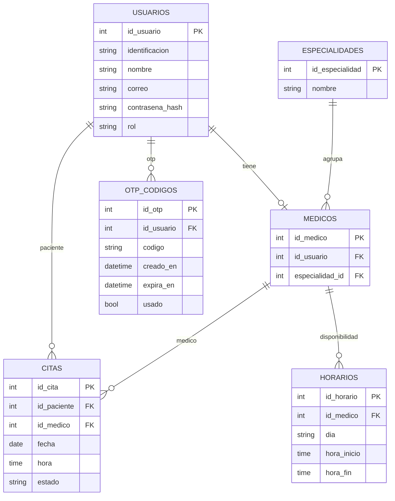

# Data model

Diagrama ER basado en los modelos SQLAlchemy.

```mermaid
erDiagram
    USUARIOS {
        int id_usuario PK
        string identificacion
        string nombre
        string correo
        string contrasena_hash
        string rol
    }

    MEDICOS {
        int id_medico PK
        int id_usuario FK
        int especialidad_id FK
    }

    ESPECIALIDADES {
        int id_especialidad PK
        string nombre
    }

    CITAS {
        int id_cita PK
        int id_paciente FK
        int id_medico FK
        date fecha
        time hora
        string estado
    }

    HORARIOS {
        int id_horario PK
        int id_medico FK
        string dia
        time hora_inicio
        time hora_fin
    }

    OTP_CODIGOS {
        int id_otp PK
        int id_usuario FK
        string codigo
        datetime creado_en
        datetime expira_en
        bool usado
    }

    USUARIOS ||--o| MEDICOS : "tiene"
    ESPECIALIDADES ||--o{ MEDICOS : "agrupa"
    USUARIOS ||--o{ CITAS : "paciente"
    MEDICOS ||--o{ CITAS : "medico"
    MEDICOS ||--o{ HORARIOS : "disponibilidad"
    USUARIOS ||--o{ OTP_CODIGOS : "otp"
```
